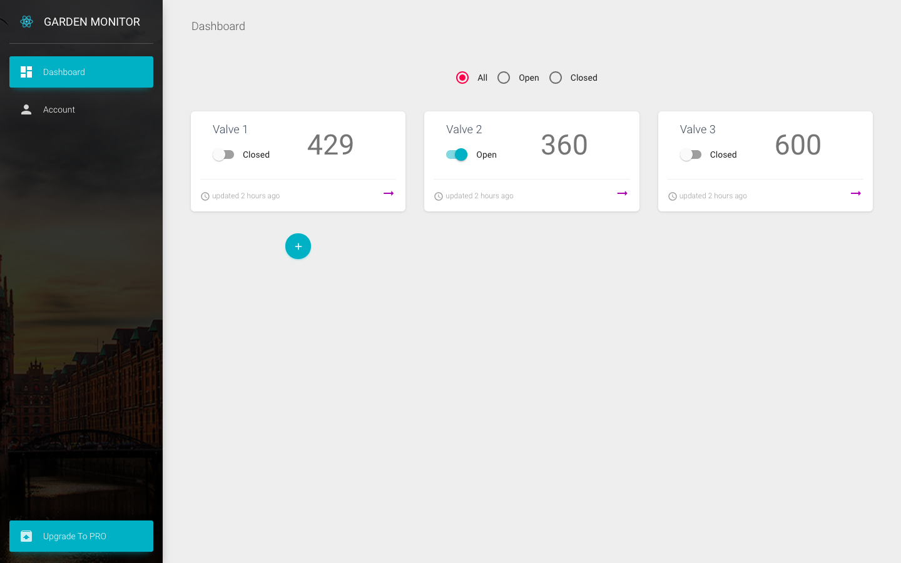

# [Garden Monitor - Garden Monitor UI](https://cjessett.github.io/garden-monitor/)
[![version][version-badge]][CHANGELOG] [![license][license-badge]][LICENSE]



User Interface for [Garden Monitor](https://github.com/cjessett/garden-monitor-api)

## Links:

+ [Live Preview](https://cjessett.com/garden-monitor/)

## Quick start

Quick start options:

- [Download from Github](https://github.com/cjessett/garden-monitor/archive/master.zip).
- Clone the repo: `git clone https://github.com/cjessett/garden-monitor.git`.

## Terminal Commands

1. Install NodeJs from [NodeJs Official Page](https://nodejs.org/en).
2. Open Terminal
3. Go to your file project
4. Run in terminal: ```yarn```
5. Then: ```yarn start```
6. Navigate to `http://localhost:3000/`
7. (optional) Run in terminal `yarn i -g cross-env`

### What's included

Within the download you'll find the following directories and files:

```
material-dashboard-react
.
├── CHANGELOG.md
├── LICENSE.md
├── README.md
├── documentation
│   ├── assets
│   │   ├── css
│   │   ├── img
│   │   │   └── faces
│   │   └── js
│   └── tutorial-components.html
├── package.json
├── public
│   ├── favicon.ico
│   ├── index.html
│   └── manifest.json
└── src
    ├── assets
    │   ├── css
    │   │   └── material-dashboard-react.css
    │   ├── img
    │   │   └── faces
    │   └── jss
    │       ├── material-dashboard-react
    │       │   ├── cardImagesStyles.jsx
    │       │   ├── checkboxAdnRadioStyle.jsx
    │       │   ├── components
    │       │   │   ├── buttonStyle.jsx
    │       │   │   ├── cardAvatarStyle.jsx
    │       │   │   ├── cardBodyStyle.jsx
    │       │   │   ├── cardFooterStyle.jsx
    │       │   │   ├── cardHeaderStyle.jsx
    │       │   │   ├── cardIconStyle.jsx
    │       │   │   ├── cardStyle.jsx
    │       │   │   ├── customInputStyle.jsx
    │       │   │   ├── customTabsStyle.jsx
    │       │   │   ├── footerStyle.jsx
    │       │   │   ├── headerLinksStyle.jsx
    │       │   │   ├── headerStyle.jsx
    │       │   │   ├── sidebarStyle.jsx
    │       │   │   ├── snackbarContentStyle.jsx
    │       │   │   ├── tableStyle.jsx
    │       │   │   ├── tasksStyle.jsx
    │       │   │   └── typographyStyle.jsx
    │       │   ├── dropdownStyle.jsx
    │       │   ├── layouts
    │       │   │   └── dashboardStyle.jsx
    │       │   ├── tooltipStyle.jsx
    │       │   └── views
    │       │       ├── dashboardStyle.jsx
    │       │       └── iconsStyle.jsx
    │       └── material-dashboard-react.jsx
    ├── components
    │   ├── Card
    │   │   ├── Card.jsx
    │   │   ├── CardAvatar.jsx
    │   │   ├── CardBody.jsx
    │   │   ├── CardFooter.jsx
    │   │   ├── CardHeader.jsx
    │   │   └── CardIcon.jsx
    │   ├── CustomButtons
    │   │   └── Button.jsx
    │   ├── CustomInput
    │   │   └── CustomInput.jsx
    │   ├── CustomTabs
    │   │   └── CustomTabs.jsx
    │   ├── Footer
    │   │   └── Footer.jsx
    │   ├── Grid
    │   │   └── GridItem.jsx
    │   ├── Header
    │   │   ├── Header.jsx
    │   │   └── HeaderLinks.jsx
    │   ├── Sidebar
    │   │   └── Sidebar.jsx
    │   ├── Snackbar
    │   │   ├── Snackbar.jsx
    │   │   └── SnackbarContent.jsx
    │   ├── Table
    │   │   └── Table.jsx
    │   ├── Tasks
    │   │   └── Tasks.jsx
    │   └── Typography
    │       ├── Danger.jsx
    │       ├── Info.jsx
    │       ├── Muted.jsx
    │       ├── Primary.jsx
    │       ├── Quote.jsx
    │       ├── Success.jsx
    │       └── Warning.jsx
    ├── index.js
    ├── layouts
    │   └── Dashboard
    │       └── Dashboard.jsx
    ├── logo.svg
    ├── routes
    │   ├── dashboard.jsx
    │   └── index.jsx
    ├── variables
    │   ├── charts.jsx
    │   └── general.jsx
    └── views
        ├── Dashboard
        │   └── Dashboard.jsx
        ├── Icons
        │   └── Icons.jsx
        ├── Maps
        │   └── Maps.jsx
        ├── Notifications
        │   └── Notifications.jsx
        ├── TableList
        │   └── TableList.jsx
        ├── Typography
        │   └── Typography.jsx
        ├── UpgradeToPro
        │   └── UpgradeToPro.jsx
        └── UserProfile
            └── UserProfile.jsx
```

## Useful Links

Bootstrapped with [Material Dashboard React](http://www.creative-tim.com/product/material-dashboard-react) by Creative Tim: <https://www.creative-tim.com/bootstrap-themes>

[CHANGELOG]: ./CHANGELOG.md

[LICENSE]: ./LICENSE.md
[version-badge]: https://img.shields.io/badge/version-0.0.1-blue.svg
[license-badge]: https://img.shields.io/badge/license-MIT-blue.svg
